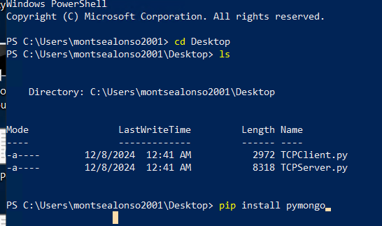
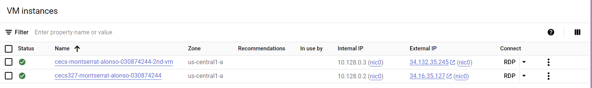
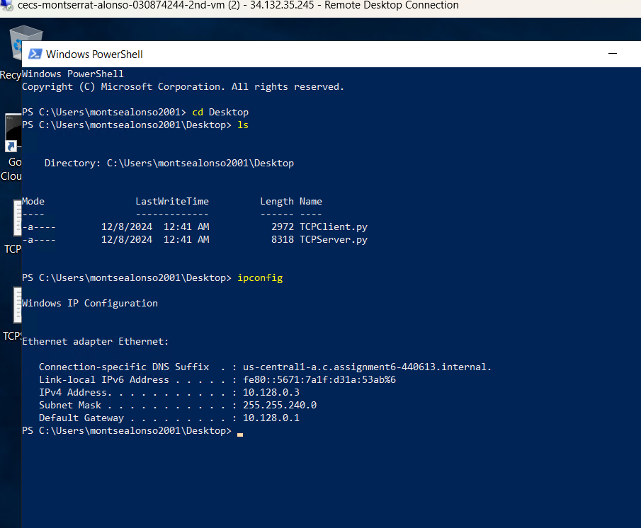
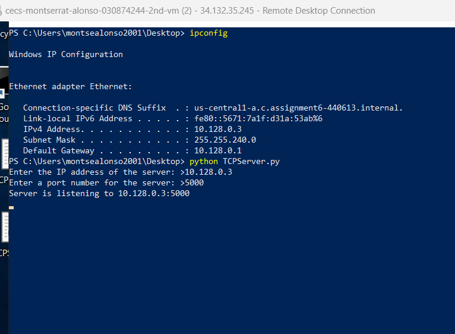
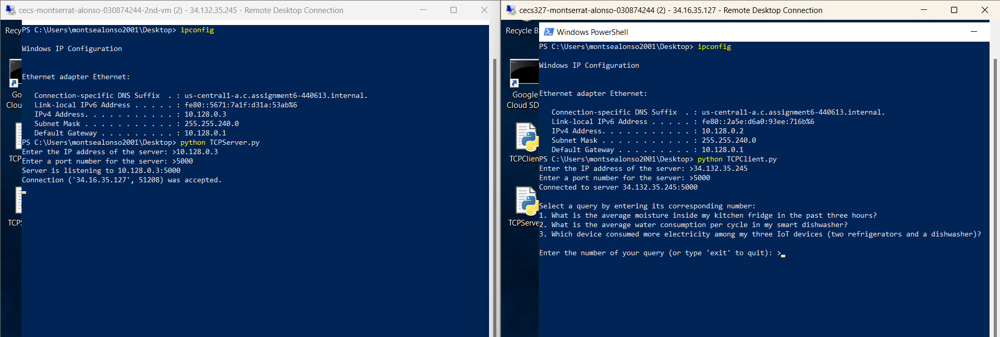
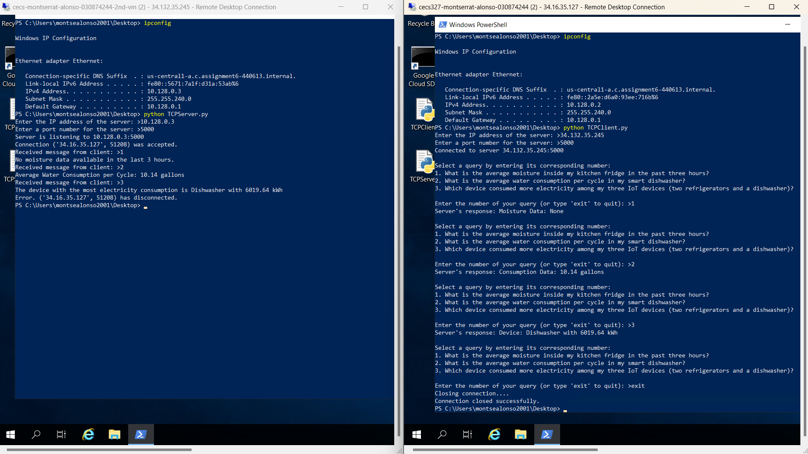

First you must get the virtual machines from Google cloud set up properly. Then you will need to have the client.py and server.py code in each VM or in just one. Now that the VM is set up with the codes, you will need to change the directory to where the files are located and then before you run the programs you must install pymongo. You will type "pip install pymongo" like in the image below and it'll be downloaded in order to run the programs.  If you don't install it and decide to run it first, it'll give you an error of having it installed.

Now that pymongo has been installed, when you run the code in the virtual machine you must know your IP address(private and public). You can easily find the IP addresses on Google Cloud where you started the VM's, and it'll be Internal IP and External IP, like in the 1st image below. If you are unable to get to Google Cloud, you can look on your VM for your Internal and External IP addresses. Your external IP address will be displayed at the very top of your VM window, while as for the Internal IP address, you will need to type "ipconfig" in the terminal. Once you type "ipconfig" in the terminal, you will look at the IPv4 Address, that will be your Internal IP.

Now that we have our IP addresses, you will need to run the server first, and to do that you will type "python Server.py". Then you'll be prompted to type an IP address, you will type the Internal IP address and any port number, in this case we can use 5000. The server will then be listening for a connection, and we can start our client the same way by typing "python Client.py". For the client, when it prompts you for the IP address, you will type the public IP of the server and the same port number(5000). Next, you will see a successful connection between server and client and a menu displayed for the queries. There are 3 queries to go through but 4 options, to go through the queries you can just type the number, for example, 1 for the 1st query display, 2 for the 2nd and so on. The 4th option you will have to type out "exit" in order to exit the program of the client and disconnect from the server. 

Please reference the images below for a visual explanation:

This is when the connection is established:

This showcases all the options when client enters 1-3 and types exit:

NOTE: These screenshots were taken when Dataniz was turned off so that's why for Query 1, we have NONE because it has not been running for the past 3 hours